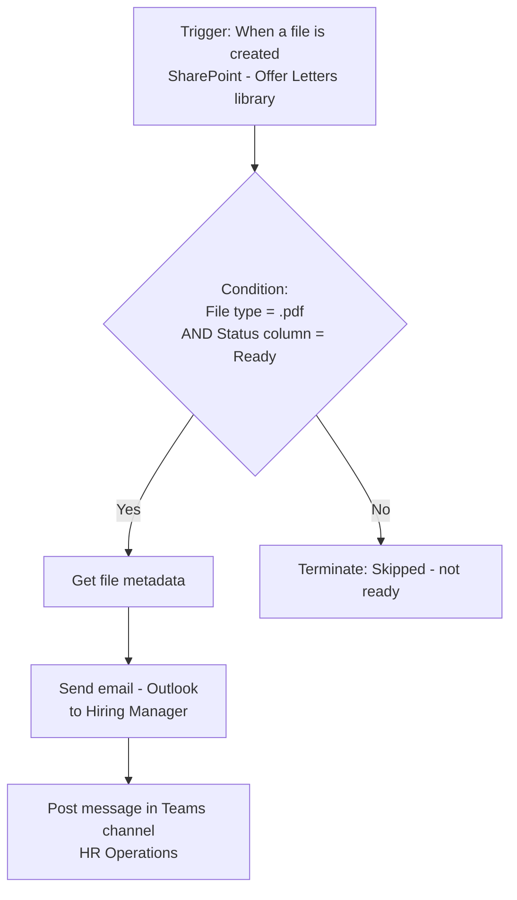

# Project 1 — Flow Fundamentals: Triggers, Actions & Conditions
### 🟢 Difficulty: Beginner

**Power Automate capability focus:** Automated cloud flows, scheduled cloud flows, core actions, conditions, standard connectors
**Connectors used:** SharePoint, Outlook, Microsoft Teams
**Baseline:** Power Automate, as of July 2026 (2026 Release Wave 1 — improved flow management, capacity notifications)

---

## 1. What you're building

**"New Hire Document Notifier"** — when HR uploads a new offer letter to a SharePoint document library, the flow checks the file type and status, emails the hiring manager, and posts a Teams channel notification. This is the correct first Power Automate project because every later project in this repo is built from these same three primitives: a **trigger**, one or more **actions**, and a **condition**.

## 2. Why this is genuinely Beginner (and why that's fine)

No loops, no variables, no error handling — just: pick the right trigger type, wire up two connectors, and branch on one condition. You should be able to finish this in under an hour and understand exactly what each piece does before layering on complexity.

## 3. Architecture

## 4. Step-by-step

1. Create a new **Automated cloud flow** and select the trigger **"When a file is created (properties only)"** on the SharePoint "Offer Letters" library — note this is cheaper and faster than "When a file is created or modified" if you only care about new files.
2. Add a **Condition** action: file extension equals `.pdf` **and** the library's `Status` column equals `Ready`.
3. In the **Yes branch**, add **Get file metadata using path** to retrieve the file's display name and web URL.
4. Add **Send an email (V2)** (Outlook connector) to the hiring manager, dynamically populating the subject/body with metadata from step 3.
5. Add **Post message in a chat or channel** (Teams connector) to notify HR Operations, using an **Adaptive Card** payload instead of plain text so the message renders with a clickable "Open file" button.
6. In the **No branch**, add a **Terminate** action with status "Cancelled" and a clear comment — this makes skipped runs easy to distinguish from failed runs in run history, which matters once you have dozens of flows to monitor.
7. Turn the flow on, upload a real test file, and check **run history** — confirm the condition evaluated correctly and both actions fired.
8. Rename every action from its default name ("Condition", "Send an email (V2)") to something descriptive ("Check file is ready", "Notify hiring manager") — this single habit is what makes flows maintainable by someone other than you.

## 5. Best practices demonstrated
- **Use the narrowest trigger available** ("created" vs. "created or modified") to reduce unnecessary runs and stay well under action-per-day limits.
- **Name every action meaningfully** — default names become unreadable the moment a flow has more than 5 steps.
- **Use Terminate with a clear status/comment on the "No" path** instead of just letting the flow end silently, so run history is self-explanatory.

## 6. Limitations to know at this level
- **Trigger recurrence and polling**: SharePoint triggers poll on an interval (not always instant); don't design a "must fire within 2 seconds" scenario on a polling trigger.
- **Connector throttling**: the SharePoint connector has per-connection request limits — a flow that fires on every file change in a very high-volume library can hit throttling; scope your trigger folder narrowly.
- **Free/standard license scope**: this project only needs **standard connectors** (SharePoint, Outlook, Teams), so it runs on a Power Automate Free license, a Microsoft 365-included license, or Premium — no Process license or premium connector entitlement needed yet.

## 7. Licensing note
- Standard connectors only → covered by a Microsoft 365 seeded license or the free Power Automate plan; no premium/per-flow licensing required for this project.

## 8. Demo script
1. Upload a PDF with `Status = Ready` — show the email and Teams notification firing.
2. Upload a `.docx` file — show the condition correctly skipping it, with a clean "Cancelled" status in run history, not a red error.
3. Walk through the run history and point out the descriptive action names doing their job.

## 9. Skills this project proves
Trigger-type selection, condition branching, clean run-history hygiene, and the naming discipline every later, more complex flow in this repo depends on.

**🔗 Live HTML mockup:** see `index.html` in this folder.
