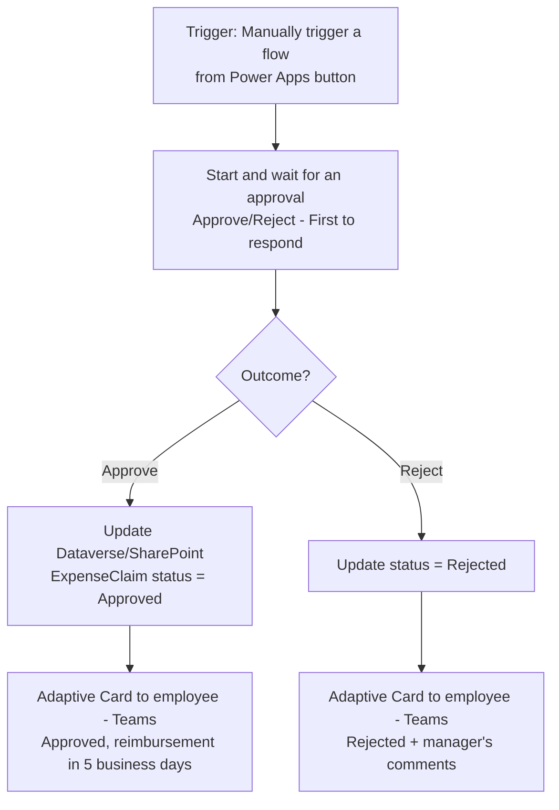

# Project 2 — Approvals & Adaptive Cards: Human-in-the-Loop Flows
### 🟢 Difficulty: Beginner

**Power Automate capability focus:** Instant cloud flows, the Approvals connector, Adaptive Cards, manual triggers from Power Apps/button
**Connectors used:** Approvals, Microsoft Teams, Outlook, Power Apps (trigger)
**Baseline:** Power Automate, as of July 2026

---

## 1. What you're building

**"Expense Approval Flow"** — an employee submits an expense claim (via a button/Power Apps trigger), the flow starts a formal **Approval** request routed to their manager, and depending on the outcome, notifies the employee and logs the decision. This is the natural second beginner project because it introduces **human-in-the-loop** automation — the pattern nearly every real business process needs somewhere.

## 2. Why this is Beginner

Still no loops or variables — but you now have to think about **who approves what**, **what happens while waiting**, and **how the outcome branches the rest of the flow**. This is the first project where the flow's real-world correctness depends on getting a business rule right, not just wiring up connectors.

## 3. Architecture

## 4. Step-by-step

1. Create an **Instant cloud flow** triggered by **"Manually trigger a flow"** with inputs for amount, category, and receipt attachment — this is what a Power Apps canvas app or a Teams button would call.
2. Add **Start and wait for an approval**, type **"Approve/Reject - First to respond"**, dynamically assigning the approver as the employee's manager (looked up from Dataverse/Entra ID, not hardcoded).
3. Configure the approval's **details, title, and item link** so the approver sees the amount, category, and receipt without leaving Teams.
4. Branch on the **outcome** output of the approval action using a Condition.
5. On approval, update the underlying record (Dataverse `ExpenseClaim` table or a SharePoint list) and send an **Adaptive Card** (not plain text) confirmation to the employee via Teams, including the approver's comments field.
6. On rejection, do the same but surface the **rejection reason** clearly — approvals without visible reasons are one of the most common employee complaints about "automated" approval processes.
7. Test the **timeout behavior**: approvals don't wait forever by default in some configurations — decide and document what should happen if the manager doesn't respond within your SLA (a reminder, an escalation to their manager, or just leaving it pending), even if you don't build the escalation yet — that's Project 5's problem.
8. Review the **Approvals center** (in Power Automate/Teams) to see the request from the approver's side, not just the requester's side.

## 5. Best practices demonstrated
- **Dynamic approver assignment** (looked up, not hardcoded) so the flow doesn't break the moment an org chart changes.
- **Adaptive Cards over plain-text messages** for anything with a clear outcome/action — richer, more scannable, and supports action buttons directly in Teams.
- **Always surface the "why"** on a rejection — a bare "Rejected" status with no reason is a support-ticket generator.

## 6. Limitations to know at this level
- **"First to respond" vs. "Everyone must approve"**: choosing the wrong approval type is a common design bug — "First to respond" with multiple approvers means only one person's decision counts, which surprises people who expected consensus.
- **Approval action timeout/duration**: long-running approvals (multi-week) need to account for the platform's action timeout defaults — very long-lived waits are a good candidate for the async/durable patterns covered in Project 5.
- **Adaptive Card versioning**: Teams clients render different Adaptive Card schema versions differently — test your card in the actual Teams client, not just the flow designer's preview.

## 7. Licensing note
- The Approvals connector and Teams connector are **standard connectors** — this project still doesn't require premium licensing. If the trigger comes from a **Power Apps canvas app**, the app itself may need appropriate Power Apps licensing, which is separate from the flow's own connector licensing.

## 8. Demo script
1. Submit a sample expense claim — show the Adaptive Card approval landing in the manager's Teams Approvals center.
2. Approve it — show the employee receiving a clear, friendly confirmation card.
3. Submit a second claim and reject it with a comment — show the rejection reason surfacing clearly to the employee.

## 9. Skills this project proves
Human-in-the-loop flow design, dynamic approver resolution, Adaptive Card authoring for two-way business communication, and thinking through approval-type semantics before building.

**🔗 Live HTML mockup:** see `index.html` in this folder.
