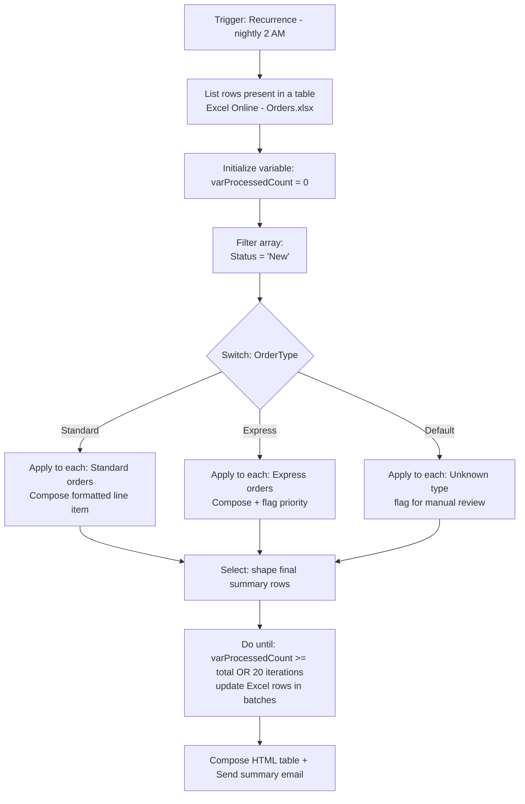

# Project 3 — Data Operations & Control Flow Mastery
### 🟡 Difficulty: Intermediate

**Power Automate capability focus:** Variables, Compose, Parse JSON, Select, Filter array, Apply to each, Do until, Switch
**Connectors used:** Excel Online (Business), SharePoint, Outlook
**Baseline:** Power Automate, as of July 2026

---

## 1. What you're building

**"Bulk Order Processing from Excel"** — a nightly scheduled flow reads a rows-of-orders Excel table, filters to only unprocessed orders, transforms and validates each row, batches them into a summary email, and writes results back. This project exists specifically to force you through every core data-shaping action in Power Automate in one coherent scenario, instead of learning them piecemeal across unrelated tutorials.

## 2. Why this is Intermediate

Beginner projects react to one event and follow one path. This project processes a **collection of unknown size**, requires **shaping data between actions** (JSON in, filtered array out, formatted table in an email), and introduces the loop-performance and payload-size thinking that trips up most self-taught makers.

## 3. Architecture

## 4. Step-by-step

1. Set up a **Recurrence trigger** for a nightly run; explicitly set the timezone — recurrence triggers default to UTC and this is a very common source of "why did it run at the wrong time" bugs.
2. Use **List rows present in a table** (Excel Online) to pull all order rows into an array.
3. **Initialize variables** up front for anything you'll accumulate or check later (`varProcessedCount`, `varErrorList` as an array) — initializing variables at the top of the flow, not inline mid-flow, is a core readability convention.
4. Use **Filter array** to reduce the dataset to only `Status = 'New'` rows **before** looping — filtering before the loop, not inside it with a Condition on every iteration, is a meaningful performance and cost practice.
5. Use a **Switch** action on `OrderType` to branch standard vs. express vs. unknown handling, instead of nested Conditions — Switch is more readable than 3 nested If/Else blocks once you have 3+ branches.
6. Inside each **Apply to each**, use **Compose** to build a formatted line-item object rather than referencing deeply nested dynamic content directly in later actions — Compose makes debugging dramatically easier because you can inspect its output directly in run history.
7. After the loops, use **Select** to reshape the accumulated results into a clean array of `{OrderId, Customer, Amount, Status}` objects, ready for both the Excel update and the summary email.
8. Use a **Do until** loop to batch-update Excel rows in chunks (Excel connector row-update actions can throttle on very large single-row-at-a-time loops) — cap it with both a row-count condition **and** an explicit iteration limit to guarantee it can't run away.
9. Build the summary email using an **HTML table** generated from the Select output (a simple inline expression-built table, or a formatted variable) rather than dumping raw JSON into the email body.
10. Test with a **deliberately malformed row** (missing OrderType, blank amount) and confirm it lands in the "unknown/manual review" branch instead of crashing the whole run.

## 5. Best practices demonstrated
- **Filter before you loop**, not inside the loop — fewer iterations, fewer actions, lower cost, faster runs.
- **Compose intermediate values** so run history shows exactly what shape your data was at each step — this alone cuts debugging time dramatically.
- **Switch over nested Conditions** once you have more than two branches — readability compounds in value as flows grow.
- **Always cap Do until with both a condition and a hard iteration limit** — an unbounded or misconfigured Do until is one of the most common causes of runaway flows.

## 6. Limitations to know at this level
- **Apply to each concurrency**: by default, Apply to each can run iterations in parallel (concurrency control), which is faster but can cause race conditions if iterations write to a shared variable — turn concurrency off explicitly when iterations aren't independent.
- **Array size and payload limits**: very large arrays (tens of thousands of rows) can hit action input/output size limits — for genuinely large datasets, consider pagination or a Dataverse-based approach instead of a single in-memory array.
- **Do until hard cap**: Power Automate enforces a maximum iteration count and timeout on Do until loops — design your batch size so you can't accidentally need more iterations than the platform allows.
- **Excel Online connector throttling**: row-by-row updates against Excel are noticeably slower and more throttle-prone than Dataverse or SQL equivalents at scale — this is a strong argument for migrating high-volume scenarios off Excel, a lesson Project 4 builds on directly.

## 7. Licensing note
- Excel Online (Business), SharePoint, and Outlook are all **standard connectors** — no premium licensing required for this project as written.

## 8. Demo script
1. Run the flow against a test spreadsheet with a mix of standard, express, and malformed rows.
2. Open run history and show the Compose outputs at each stage — narrate how this makes debugging transparent.
3. Show the final HTML summary email and the updated Excel rows.
4. Deliberately misconfigure the Do until's exit condition in a sandbox copy and show the hard iteration cap preventing a runaway loop.

## 9. Skills this project proves
Correct use of every core data-shaping and control-flow action, loop-performance thinking, and the debugging discipline (Compose everywhere) that scales to much larger flows later in this repo.

**🔗 Live HTML mockup:** see `index.html` in this folder.
