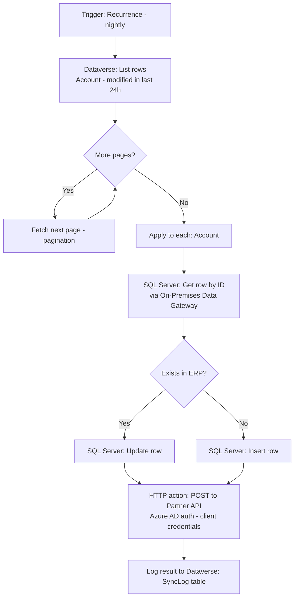

# Project 4 — Connectors & Integration Hub: Dataverse, SQL & HTTP
### 🟡 Difficulty: Intermediate

**Power Automate capability focus:** Premium connectors (Dataverse, SQL Server), the HTTP action with Azure AD authentication, custom connector consumption, pagination
**Connectors used:** Dataverse, SQL Server, HTTP (premium), Custom Connector
**Baseline:** Power Automate, as of July 2026

---

## 1. What you're building

**"CRM-to-ERP Nightly Sync"** — a scheduled flow that reads updated customer records from Dataverse, upserts matching records into an on-premises SQL Server ERP database (via the on-premises data gateway), and calls an external partner's REST API (via HTTP with Azure AD auth) to confirm the sync — the exact kind of "connect three systems that were never designed to talk to each other" project that makes up most real enterprise automation work.

## 2. Why this is Intermediate

This is the first project touching **premium connectors** and real licensing implications, **on-premises connectivity** via the data gateway, and **authenticated external API calls** — each of which introduces failure modes that don't exist when you stay inside SharePoint/Outlook/Teams.

## 3. Architecture

## 4. Step-by-step

1. Connect to **Dataverse** and use **List rows**, filtering on `modifiedon` in the last 24 hours; explicitly configure **pagination** (Power Automate's Dataverse connector paginates automatically up to a configurable threshold — set this deliberately rather than assuming the default is enough for your data volume).
2. Install and register the **On-premises data gateway** if the ERP's SQL Server isn't cloud-reachable directly; understand that the gateway becomes a **single point of failure and a licensing/administration responsibility** your team now owns.
3. Inside the loop, use **SQL Server "Get row"** to check whether the account already exists in the ERP by an external ID/key column, then branch to **Update row** or **Insert row** accordingly (a manual upsert pattern, since not all SQL connector actions natively upsert).
4. Add an **HTTP (Premium) action** to call the partner's confirmation API: configure **Azure AD authentication** (client credentials flow) rather than embedding a static bearer token in the flow — tokens in plaintext inside flow definitions are a real security anti-pattern.
5. Parse the HTTP response with **Parse JSON** and branch on the partner API's own success/failure indicator — don't assume an HTTP 200 means the business operation actually succeeded; many APIs return 200 with an error payload.
6. Log every sync attempt — success or failure — to a Dataverse `SyncLog` table with the account ID, timestamp, and outcome, so you have an audit trail independent of Power Automate's own run history (which eventually ages out).
7. Test the **gateway offline scenario**: stop the gateway service temporarily and confirm the flow fails clearly and logs the failure, rather than hanging indefinitely.
8. Review the **connector reference** for both Dataverse and SQL Server to understand their specific **throttling limits** (requests per connection per time window) before assuming this pattern scales to tens of thousands of accounts unchanged.

## 5. Best practices demonstrated
- **Explicit pagination handling** rather than assuming a single "list rows" call returns everything.
- **Azure AD/OAuth authentication over static API keys or bearer tokens** for any HTTP action calling a secured external API.
- **Independent audit logging** (Dataverse `SyncLog`) separate from Power Automate's own run history, which has retention limits.
- **Don't trust HTTP 200 as success** — always parse and check the actual business-logic result in the response body when the API supports it.

## 6. Limitations to know at this level
- **On-premises data gateway is a single point of failure** — for production, plan a gateway cluster (multiple gateway installations sharing load/failover), not a single gateway machine.
- **SQL Server connector and Dataverse connector both throttle** per connection — a nightly sync of a very large account base may need to be chunked across multiple flow runs or use a bulk/batch API pattern instead of row-by-row HTTP calls.
- **HTTP (Premium) action requires a premium license or Process license** — this is the point in the repo where licensing cost becomes a real design input, not an afterthought.
- **Custom connectors built on top of HTTP inherit the same premium requirement** and add their own versioning/maintenance burden — evaluate whether a custom connector or a raw HTTP action is more appropriate per Project 5/6 in the companion Copilot Studio repo's Project 5 logic (same trade-off applies here).

## 7. Licensing note
- **HTTP (Premium), SQL Server, and Dataverse are premium connectors.** Every unique user account context this flow runs under needs a **Power Automate Premium** (or higher) license, **or** the flow itself can be assigned a **Process license**, which licenses the flow itself regardless of how many people it serves or who triggers it — the right choice depends on whether one person owns this flow (use a Premium user license) or many people effectively depend on it as shared infrastructure (use a Process license, especially for solution-aware flows run under a Service Principal in a proper ALM setup, covered in Project 7).
- **On-premises data gateway** licensing/administration is included with a qualifying Power Automate/Power Apps license but needs a dedicated always-on host machine — budget that infrastructure cost separately from the Power Automate license itself.

## 8. Demo script
1. Run the sync against a handful of test Dataverse accounts and show them landing correctly in SQL Server (insert and update paths both).
2. Show the HTTP call and its parsed response driving the final log entry.
3. Stop the on-premises gateway and re-run — show the clean failure and log entry instead of a silent hang.
4. Open the Dataverse `SyncLog` table and show the durable audit trail.

## 9. Skills this project proves
Premium connector usage and its licensing implications, on-premises connectivity via the data gateway, secure HTTP/Azure AD authentication patterns, and building an audit trail independent of platform run-history retention.

**🔗 Live HTML mockup:** see `index.html` in this folder.
