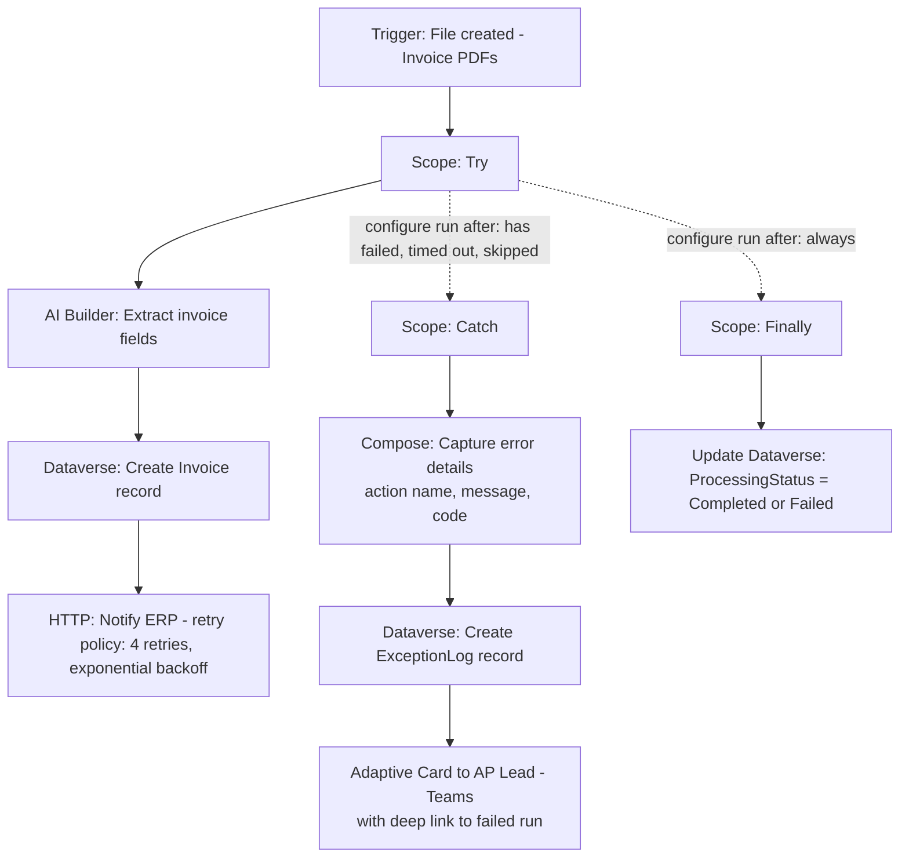

# Project 5 — Error Handling, Reliability & Retry Policies
### 🟠 Difficulty: Advanced

**Power Automate capability focus:** Scopes, Configure run after, retry policies, try/catch/finally pattern, exception logging, alerting
**Connectors used:** SharePoint, Dataverse, Outlook, Teams
**Baseline:** Power Automate, as of July 2026 — cloud flow makers benefit from improved flow management and self-service restore capabilities (2026 Release Wave 1)

---

## 1. What you're building

**"Resilient Invoice Ingestion Pipeline"** — takes the kind of invoice-processing flow you'd build casually in Project 3/4 and rebuilds it with genuine production reliability engineering: a formal try/catch/finally structure using **Scopes**, explicit **retry policies** on flaky external calls, a **dead-letter/exception queue** for anything that can't be auto-resolved, and proactive **alerting** — the difference between a flow that works in the demo and one that survives contact with production for a year.

## 2. Why this is Advanced

Every project so far assumed the happy path mostly works. This project assumes the opposite: connectors will throttle, external APIs will time out, and a malformed record will eventually appear. The skill here is designing for that reality **before** it happens in production, not reactively after an angry email from the business.

## 3. Architecture

## 4. Step-by-step

1. Wrap the entire main logic in a **Scope named "Try"** — this is the foundational structural change from earlier projects, where actions just sat loose in the flow.
2. Add a second **Scope named "Catch"**, and configure its **"Configure run after"** setting on the Try scope to trigger when Try **has failed, has timed out, OR is skipped** — all three, not just "has failed," or genuinely broken runs will slip past your error handling.
3. Add a third **Scope named "Finally"**, configured to run after Try with **all four statuses checked** (succeeded, failed, skipped, timed out) — this is where cleanup/status-update logic goes that must run no matter what happened.
4. Inside Catch, use **Compose** actions referencing the failed action's `result()` expression to extract the specific error message, status code, and which action actually failed — a generic "something went wrong" alert is far less useful than "the HTTP action to ERP failed with a 503."
5. Configure an explicit **retry policy** on the HTTP action calling the external ERP: exponential backoff, capped at a sensible number of retries (e.g., 4) — don't rely purely on the connector's default retry behavior for calls you know are prone to transient failures.
6. Log every failure to a **Dataverse `ExceptionLog` table** (invoice ID, failed action, error message, timestamp, retry count) — this becomes your dead-letter queue and the data source for a "what keeps failing" report, not just a one-off Teams ping that gets lost in the noise.
7. Send a **Teams Adaptive Card alert** to the AP lead on genuine failures, with a **deep link to the specific failed run** in Power Automate — so triage doesn't require searching through hundreds of runs manually.
8. Add a **circuit-breaker-style safeguard**: if the same external system fails more than N times in an hour (queryable from your `ExceptionLog`), stop retrying and escalate immediately instead of continuing to hammer a system that's clearly down.
9. Deliberately break the HTTP endpoint (point it at an invalid URL temporarily) and confirm the entire Catch → log → alert → Finally sequence fires correctly end-to-end.
10. Use the flow's **run history and, where available, self-service restore capabilities** to understand how to recover/resubmit a specific failed run without manually re-triggering the whole pipeline from scratch.

## 5. Best practices demonstrated
- **Try/Catch/Finally via Scopes and "Configure run after"** is the standard Power Automate reliability pattern — know it well enough to build it from memory.
- **Always check all relevant statuses** (failed, timed out, skipped) on Configure run after — checking only "has failed" is a common, dangerous oversight.
- **Log exceptions to a durable table**, not just a transient Teams message — you need historical, queryable failure data to spot patterns.
- **Retry policies belong on the specific actions that need them**, tuned to that system's known behavior — not a single blanket setting across the whole flow.

## 6. Limitations to know at this level
- **Default retry policies are conservative** — for connectors/actions known to be flaky, explicitly configure a stronger policy rather than trusting the default.
- **Scopes can't fully "undo" partial side effects** — if action 2 of 3 inside a Try scope succeeded before action 3 failed, Power Automate does not automatically roll back action 2's effects; you must design compensating logic yourself if partial completion is unacceptable for your scenario.
- **Flow run history has a retention window** — this is exactly why the project logs to a Dataverse table instead of relying on Power Automate's own history as your long-term audit record.
- **Nested Scopes add readability overhead** — for very simple flows, a full Try/Catch/Finally structure can be overkill; reserve it for flows where failure has real business cost (financial transactions, external-system writes), which is most of what you'll build professionally, but not everything.

## 7. Licensing note
- No new connector licensing tier introduced here beyond Project 4's premium connectors — the "cost" this project adds is **engineering discipline**, not additional Power Automate license spend. That said, Dataverse storage for the `ExceptionLog` table draws from your tenant's Dataverse capacity, worth tracking at scale.

## 8. Demo script
1. Run a normal invoice through — show the Finally scope updating status cleanly.
2. Break the ERP endpoint and re-run — narrate the Catch scope firing, the exception log entry being created, and the Teams alert landing with a working deep link.
3. Show the `ExceptionLog` table and how it could answer "what's our most common failure mode this month?"
4. Explain the circuit-breaker safeguard and why it exists (protecting a struggling downstream system from a retry storm).

## 9. Skills this project proves
Structural error handling with Scopes and Configure run after, tuned retry policy design, durable exception logging as a dead-letter pattern, and the judgment to know when this level of reliability engineering is (and isn't) worth the added complexity.

**🔗 Live HTML mockup:** see `index.html` in this folder.
