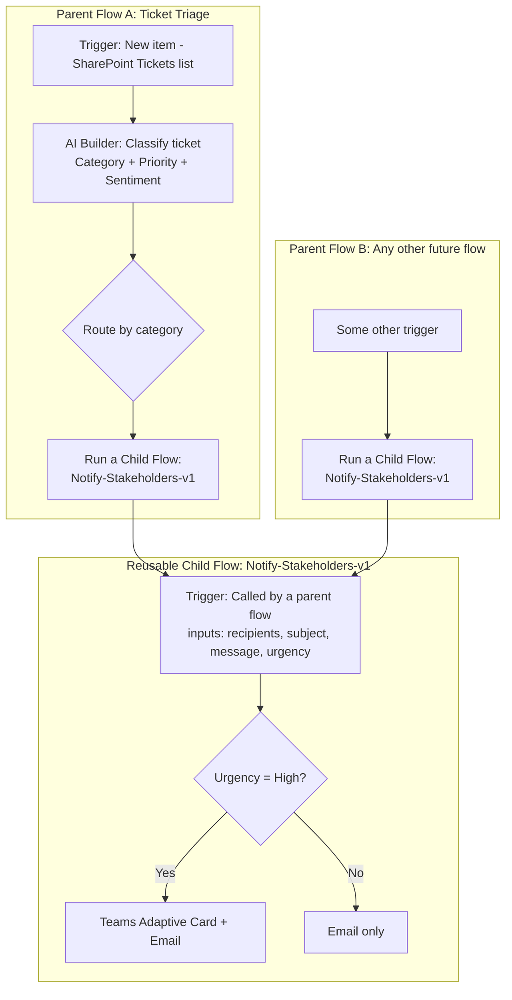

# Project 6 — Child Flows, Reusable Components, AI Builder & Copilot-Authored Flows
### 🟠 Difficulty: Advanced

**Power Automate capability focus:** Trigger-a-flow-from-another-flow (child flows), environment variables, AI Builder in flows, Copilot in cloud flows (natural-language flow authoring)
**Connectors used:** AI Builder, SharePoint, Teams, child flow invocation
**Baseline:** Power Automate, as of July 2026 — Copilot in cloud flows GA in supported regions, AI Builder credit model transitioning toward Copilot Credits (AI Builder seeded credits end November 1, 2026)

---

## 1. What you're building

Two connected components: (1) a **shared reusable child flow** — "Notify-Stakeholders-v1" — that any other flow in the organization can call instead of re-building notification logic every time, and (2) an **AI-powered ticket triage flow** that uses **AI Builder** to classify and route incoming support tickets, **built partly by describing it to Copilot in Power Automate** in natural language rather than hand-wiring every action.

## 2. Why this is Advanced

This project requires thinking about **flows as software components** (inputs, outputs, versioning, who depends on what) rather than one-off automations, plus embedding genuine AI model inference into a business process, plus adopting an AI-assisted authoring workflow that changes how you build flows going forward.

## 3. Architecture

## 4. Step-by-step

### Part A — Build the reusable child flow
1. Create a flow using the trigger **"Called by a parent flow"** (the dedicated child-flow trigger type), and explicitly define its **input parameters**: `recipients`, `subject`, `message`, `urgency`.
2. Build the internal logic (urgency-based branching to Teams+Email vs. Email-only) exactly as you would in a standalone flow.
3. Add a **Respond to the parent flow** action if the caller needs a result back (e.g., "notification sent" confirmation), not just fire-and-forget.
4. Publish it clearly named and described (`Notify-Stakeholders-v1` — the version suffix matters, see best practices below) so other makers in your organization can discover and reuse it via the "Run a Child Flow" action.

### Part B — Build the AI-powered parent flow, partly via Copilot
5. Start a new flow and use **Copilot in cloud flows**: describe it in natural language following the recommended `When X happens, do Y` format — e.g., *"When a new item is created in the Tickets SharePoint list, classify its category and priority using AI, then notify the right team."*
6. Review what Copilot generates — confirm trigger and initial actions match intent, then use **"Add more details for Copilot to work with"** to refine (e.g., specify the exact SharePoint list and the categories you want AI Builder to classify into).
7. Once the skeleton is in place, manually add the **AI Builder "Extract information from text" or a Prompt-based classification action**, mapping the ticket description as input and defining the categories (Billing, Technical, Access Request, Other) and a priority score as outputs.
8. Add routing logic (Switch/Condition) based on the AI Builder output, and call your **Notify-Stakeholders-v1 child flow** from each branch instead of duplicating notification logic.
9. Test with **deliberately ambiguous ticket text** and confirm the AI Builder confidence score is checked — low-confidence classifications should route to a "manual triage" branch rather than being auto-routed with false confidence.
10. Document which parts of this flow were **Copilot-generated vs. hand-built** as a team practice — this transparency matters for maintainability, since a future maker debugging the flow should know which sections came from a natural-language description versus deliberate manual design.

## 5. Best practices demonstrated
- **Version your child flow names explicitly** (`-v1`, `-v2`) — child flows are shared infrastructure; a breaking change to inputs/outputs can silently break every parent flow calling it if you don't manage versions deliberately.
- **Define clear input/output contracts** on child flows, the same discipline you'd apply to an API or a function signature.
- **Check AI Builder confidence scores** before acting autonomously on a classification — route low-confidence results to a human, exactly like the pattern used in the companion Copilot Studio repo.
- **Use Copilot in cloud flows for scaffolding, not blind trust** — always review and test what it generates, and be explicit with your team about which logic was AI-assisted.

## 6. Limitations to know at this level
- **Copilot in cloud flows has editor restrictions**: it can't edit flows with certain legacy configurations (non-OpenAPI connections, flows containing comments, certain hybrid triggers, Power Apps V1 triggers) — know these restrictions before assuming you can always drop into Copilot mode on an existing older flow.
- **Copilot in cloud flows is optimized for English** and has limited support in other languages — plan authoring workflows accordingly for multilingual teams.
- **Child flows add a layer of indirection**: debugging a parent flow that calls a child flow requires checking both run histories — this is a real cost against the reuse benefit, and is only worth it once logic is genuinely shared across 2+ parents.
- **AI Builder credits are changing**: the 5,000 seeded AI Builder credits included per user license are removed on **November 1, 2026**, after which AI Builder capability usage bills through the Copilot Credit model instead — budget for this transition now if this flow (or others like it) will be running past that date.

## 7. Licensing note
- **AI Builder** consumption requires AI Builder credits (seeded credits ending November 1, 2026) or, from that date forward, Copilot Credits — factor this into your operating cost model, not just your one-time build cost.
- **Copilot in cloud flows** requires a standalone Power Automate license, a seeded Microsoft 365 license, or a Power Apps/Dynamics license that includes it — confirm your specific license SKU includes Copilot access before assuming every maker in your tenant has it.
- Child flows themselves don't have separate licensing beyond the connectors and premium features they use internally.

## 8. Demo script
1. Show the natural-language Copilot prompt and the flow skeleton it generated.
2. Submit a clear-cut ticket — show AI Builder classifying it correctly and the child flow firing the right notification.
3. Submit an ambiguous ticket — show it routing to manual triage instead of a falsely confident auto-classification.
4. Call the same child flow from a second, unrelated parent flow to prove the reuse actually works, not just in theory.

## 9. Skills this project proves
Designing flows as reusable, versioned components; embedding AI Builder classification safely with confidence-based routing; and adopting Copilot-assisted flow authoring as a genuine productivity practice rather than a novelty.

**🔗 Live HTML mockup:** see `index.html` in this folder.
