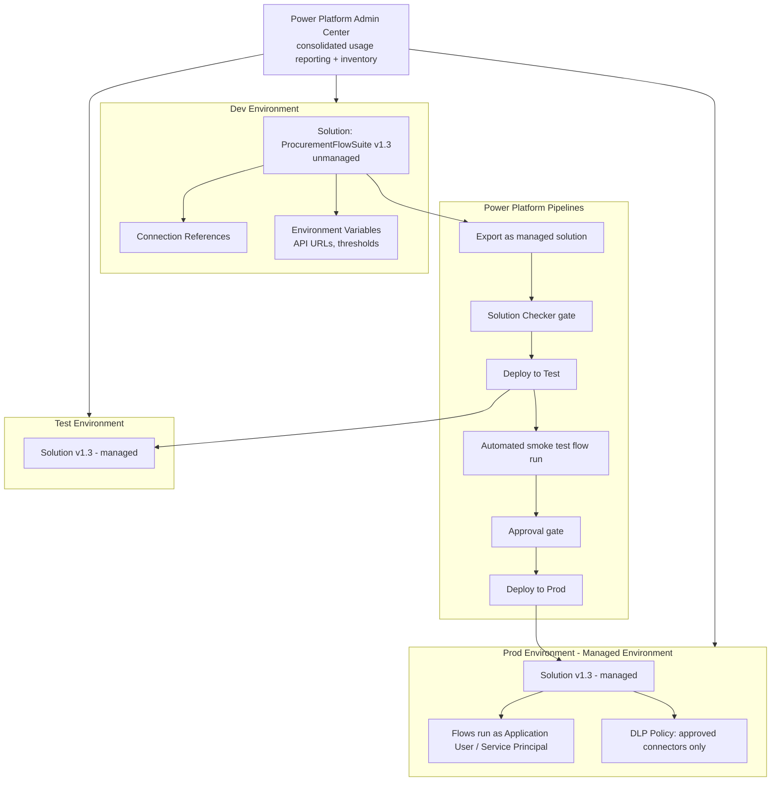

# Project 7 — Enterprise ALM, Solutions & Governance
### 🔴 Difficulty: Expert

**Power Automate capability focus:** Solution-aware flows, connection references, environment variables, DLP policies, Power Platform pipelines, flow checker, admin center monitoring, Process vs. per-user licensing decisions
**Connectors used:** All connectors from Projects 1-6, now managed under one governed solution
**Baseline:** Power Automate, as of July 2026 — consolidated licensing/usage reporting and expanded inventory details in the Power Platform admin center (2026 Release Wave 1)

---

## 1. What you're building

You take the **entire "Procurement Flow Suite"** — the invoice ingestion pipeline (Project 5), the CRM-to-ERP sync (Project 4), and the ticket triage flow (Project 6) — and re-platform it as a **single governed Dataverse solution** with proper environment separation (Dev/Test/Prod), connection references and environment variables instead of hardcoded connections, a **Power Platform pipeline** for automated promotion, and a **service principal** running the flows in production instead of a named human user.

## 2. Why this is Expert

Everything before this project was built directly in an environment with a personal connection. That doesn't survive contact with a real organization: people leave, connections break, and nobody can safely tell what changed between what's in Dev versus what's actually running in Prod. This project is where you stop being "someone who builds flows" and become someone who can be trusted to **operate flows as a maintained software asset**.

## 3. Architecture

## 4. Step-by-step

1. Create a **Solution** in your Dev environment and add all flows from Projects 4, 5, and 6 to it — this alone forces you to confront which connections each flow currently uses.
2. Convert every connection to a **Connection Reference** inside the solution — this is what allows the same flow definition to point at a different actual connection per environment without editing the flow itself.
3. Extract every hardcoded value that differs by environment (API base URLs, approval thresholds, SharePoint site URLs) into **Environment Variables** defined in the solution, with per-environment values set at import time.
4. Run the **Solution Checker** against the solution and resolve every flagged issue — this is a real quality gate, not a suggestion, especially before this solution ever reaches Prod.
5. Register an **Application User (Service Principal)** in the target environments and reassign flow ownership to run under that identity in Test and Prod — flows tied to a departing employee's personal account are a common, entirely avoidable outage.
6. Set up a **Power Platform pipeline** (or an equivalent GitHub Actions/Azure DevOps pipeline) that: exports the solution as managed, runs the Solution Checker, deploys to Test, runs an automated smoke test (trigger each flow once with known test data and verify expected output), gates on manual approval, then deploys to Prod.
7. Apply a **DLP policy** to the Prod environment restricting which connectors these flows (and any others) are allowed to use — Business/Non-Business/Blocked classification, reviewed against what Projects 4-6 actually need.
8. Turn on **Managed Environment** status for Prod and review the **consolidated licensing/usage reporting** and **expanded inventory details** (flow dependencies, connections, environment relationships) in the Power Platform admin center — this view is what lets you answer "what would break if we deprecated this SharePoint site" before you find out the hard way.
9. Decide, flow by flow, between a **per-user Premium license** and a **Process license**: a flow like the invoice pipeline that many people effectively depend on (regardless of who triggers it) is a strong Process-license candidate, since it licenses the flow itself rather than requiring every relevant user to hold a Premium license.
10. Document a **rollback plan**: if v1.4 breaks something in Prod, know exactly how to redeploy the last known-good managed solution version without guessing.

## 5. Best practices demonstrated
- **Connection references and environment variables are mandatory for solution-aware, multi-environment flows** — hardcoded connections are the single most common reason "it worked in Dev" fails in Prod.
- **Run production flows under a Service Principal**, never a named employee's personal account.
- **Solution Checker is a gate, not a courtesy** — treat findings as blocking issues in your pipeline, not optional cleanup.
- **DLP policy design should be driven by what your flows actually need**, reviewed periodically as flows evolve — not set once and forgotten.

## 6. Limitations to know at this level
- **Not all flow types are equally solution-friendly** — verify your specific trigger types and connectors are fully solution-aware before committing to this pattern; some legacy or hybrid trigger configurations have known limitations (the same categories that also block Copilot editing, per Project 6).
- **Application Users still consume licensing** in most premium-connector scenarios — moving to a Service Principal solves the "who owns this" problem, but doesn't eliminate the need for a Process license or equivalent entitlement if premium connectors are involved.
- **Pipelines add real lead time** to shipping a small fix — for a genuine one-line emergency hotfix, know your organization's documented exception process rather than inventing one ad hoc under pressure.
- **DLP policies can break flows retroactively** if a connector's classification changes after the flow was built — review DLP impact whenever your admin team updates policy, not just at initial flow creation.

## 7. Licensing note
- This project is where the **Process license vs. per-user Premium license** decision becomes concrete and consequential — a flow serving as shared infrastructure across many employees is usually cheaper and operationally cleaner licensed once via a Process license than by requiring Premium for every relevant user.
- **Managed Environments** and **Power Platform pipelines** may have their own prerequisites/entitlements depending on your tenant's overall Power Platform licensing tier — confirm with your admin before assuming pipeline tooling is available by default.

## 8. Demo script
1. Show the solution in Dev, then the same solution, same flow logic, running in Test and Prod with completely different underlying connections and environment variable values — zero code changes.
2. Walk through one pipeline run end-to-end: export → Solution Checker → Test deploy → smoke test → approval → Prod deploy.
3. Show the Power Platform admin center's inventory view answering "which flows use this SharePoint site" — the exact question that used to require manually opening every flow to answer.
4. Explain the Process-license decision for the invoice pipeline flow specifically, with the reasoning shown, not just the conclusion.

## 9. Skills this project proves
Solution-based ALM discipline, environment-safe flow design via connection references and environment variables, Service-Principal operational ownership, DLP-aware governance, and licensing-model decision-making at the "flow as shared infrastructure" scale.

**🔗 Live HTML mockup:** see `index.html` in this folder.
