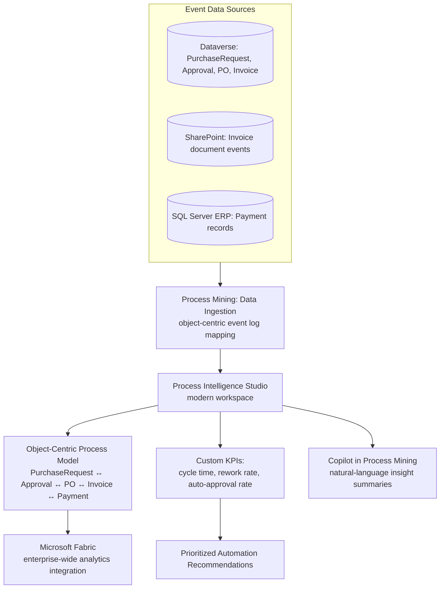

# Project 8 — Process Mining & Continuous Improvement
### 🔴 Difficulty: Expert

**Power Automate capability focus:** Object-centric process mining, the modern Process Intelligence studio workspace, Copilot in Process Mining, capacity notifications, flow groups
**Data Source:** Event logs from Dataverse, SharePoint, and the ERP/CRM systems touched by Projects 4-7
**Baseline:** Power Automate, as of July 2026 — object-centric process mining and a modern Process Intelligence studio workspace with native Microsoft Fabric integration, generally available in 2026 Release Wave 1

---

## 1. What you're building

Rather than building a new automation, this project turns the analytical lens **back onto the flows you've already built** in Projects 4-7: you ingest event data from the procurement process (purchase request → approval → PO creation → invoice → payment), use **object-centric process mining** to discover the *actual* end-to-end process as it really happens (not the idealized version in anyone's head), identify bottlenecks and deviations, and use those findings to justify and prioritize the next round of automation investment.

## 2. Why this is Expert

This requires a genuinely different skill from flow-building: **process analysis**. You need to understand event log structure, object-centric modeling (a purchase order, an invoice, and a payment are separate but related "objects" moving through a shared process, not one flat sequence), and how to translate a process-mining finding into a specific, fundable automation recommendation — the skill that turns "I automate things" into "I tell the business what to automate next, backed by data."

## 3. Architecture

## 4. Step-by-step

1. Identify every **system of record** touching the procurement process end-to-end (Dataverse for requests/approvals/POs, SharePoint for invoice documents, SQL Server ERP for payments) — process mining is only as good as the completeness of the event data feeding it.
2. Use the **data ingestion experience** in Process Mining to map each source's raw events (timestamps, case/object IDs, activity names) into a common event log structure.
3. Take advantage of **object-centric process mining** specifically: model `PurchaseRequest`, `Approval`, `PurchaseOrder`, `Invoice`, and `Payment` as **separate but related objects**, rather than forcing the whole thing into one flattened "case ID" — real procurement processes have genuine one-to-many and many-to-many relationships (one PO can span multiple invoices; one invoice can trigger multiple partial payments) that a single-case model distorts.
4. Build the process model in the **modern Process Intelligence studio workspace**: use custom layouts and define **custom KPIs** specific to this process — average cycle time from request to payment, rework rate (approvals sent back for correction), and percentage of invoices that went through full manual review versus the automated fast-path from Project 5.
5. Use **Copilot in Process Mining** to generate natural-language summaries of what the discovered model shows — practice validating its summary against the raw model yourself before presenting it, since a generated summary is a starting point for review, not a substitute for your own judgment.
6. Identify the **top 3 bottlenecks or deviations** the model surfaces — for example, a specific approval step that takes 5x longer than any other, or a recurring pattern where invoices bounce between two departments before resolution.
7. Cross-reference these findings against your **existing Project 4-7 automations**: which bottleneck is already addressed, which is only partially addressed, and which is a genuinely new automation opportunity?
8. Turn the top finding into a **concrete, scoped recommendation** — not "automate approvals" in the abstract, but "the [specific] approval step has a 3.2-day average wait time driven by [specific cause]; a targeted reminder/escalation flow would likely cut this by an estimated [X]%."
9. Set up **capacity notifications** and review **flow groups** (2026 Release Wave 1 capability enabling Process license sharing across a group of related flows) as an ongoing operational practice, so your team gets ahead of capacity issues instead of discovering them via a failed run.
10. Present the findings alongside the **Fabric-integrated** enterprise analytics view, if your organization has Fabric — this connects process-mining insight to the same governed analytics layer the rest of the business already trusts.

## 5. Best practices demonstrated
- **Model objects, not just cases** — object-centric process mining reflects how real business processes actually branch and merge; forcing everything into a single flat case ID hides exactly the deviations you're trying to find.
- **Validate AI-generated summaries against the underlying model** before presenting them — Copilot in Process Mining accelerates insight-generation, it doesn't replace analytical judgment.
- **Turn findings into scoped, quantified recommendations**, not vague directives — this is what actually gets a follow-up automation project funded.
- **Treat process mining as an ongoing practice**, not a one-time audit — re-run it periodically to measure whether your automation investments actually moved the KPIs you targeted.

## 6. Limitations to know at this level
- **Process mining quality depends entirely on event log completeness and timestamp accuracy** — a system that doesn't reliably timestamp state changes will produce a misleading model; fixing data quality upstream is sometimes the actual first recommendation, before any new flow gets built.
- **Object-centric modeling has a steeper learning curve** than traditional single-case process mining — budget real time for the team to get comfortable interpreting object-centric diagrams correctly before trusting conclusions drawn from them.
- **Correlation shown in a process model isn't automatically causation** — a bottleneck correlated with a particular approver or team needs further investigation before being presented as a root cause.
- **Copilot in Process Mining, like other Copilot capabilities, requires appropriate licensing and region availability** — confirm your environment is enabled before planning a rollout around it.

## 7. Licensing note
- Process Mining capability and capacity are licensed distinctly from standard cloud flow automation — confirm your organization's specific Process Mining entitlement (often tied to Premium/Process licensing tiers or add-on capacity) before scoping a large ingestion effort.
- **Flow groups enabling Process license sharing** (2026 Release Wave 1) can meaningfully change the economics of licensing a related family of flows (like the whole Procurement Flow Suite) — revisit your Project 7 licensing decisions in light of this capability once it's available in your tenant.

## 8. Demo script
1. Show the object-centric process model for the procurement process, highlighting the PurchaseRequest/PO/Invoice/Payment relationships.
2. Walk through the top bottleneck the model surfaced, backed by the specific KPI number.
3. Show the Copilot-generated natural-language summary next to your own validated interpretation — point out anywhere they usefully agree or where your review caught something Copilot's summary missed.
4. Present the scoped, quantified automation recommendation that comes out of this analysis — this is the artifact that should drive the next quarter's automation roadmap.

## 9. Skills this project proves
Object-centric process analysis (not just flow-building), translating data into fundable automation recommendations, responsible use of AI-generated analytical summaries, and closing the loop between "we automated something" and "did it actually work, and what should we do next."

**🔗 Live HTML mockup:** see `index.html` in this folder.
