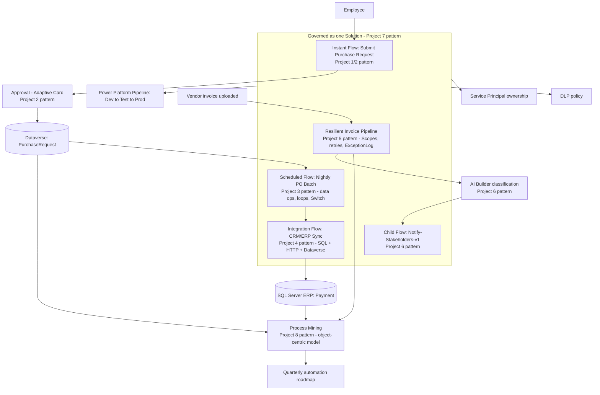

# Project 9 — CAPSTONE: Global Procure-to-Pay Automation Command Center
### ⭐ Difficulty: Capstone (integrates Beginner → Expert)

**Power Automate capability focus:** Every capability from Projects 1-8, unified into one governed, monitored, continuously-improved automation platform
**Connectors used:** SharePoint, Outlook, Teams, Approvals, Excel Online, Dataverse, SQL Server, HTTP (Premium), AI Builder
**Baseline:** Power Automate, as of July 2026

---

## 1. What you're building

A single, coherent **Procure-to-Pay Automation Platform** spanning purchase request submission through vendor payment — built by connecting every pattern from Projects 1-8 into one operating system for the process, rather than eight disconnected demo flows. This is the project to lead with when demonstrating **complete, practitioner-level command of Power Automate cloud flows**.

## 2. Why this is the capstone

Project 7 proved you can govern a solution; Project 8 proved you can analyze a process. This capstone proves you can do **both at once, continuously**: build the automation (Projects 1-6's patterns), govern it properly in production (Project 7), and keep measuring and improving it (Project 8) — which is what "this automation platform is actually done" means in a real organization, as opposed to "the demo worked."

## 3. Unified architecture

## 4. Step-by-step implementation plan

### Phase 0 — Foundation
1. Stand up the **Dev/Test/Prod environment strategy** and the governing **Solution** (Project 7 pattern) before building a single new flow for this capstone — governance-first, exactly as the Copilot Studio capstone in the companion repo insists on agent inventory before building agents.
2. Define the **Dataverse data model** shared across every flow: `PurchaseRequest`, `PurchaseOrder`, `Invoice`, `Payment`, `ExceptionLog`, `SyncLog` — one schema, not per-flow ad hoc tables.

### Phase 1 — Bring in the building blocks (reuse, don't rebuild)
3. Rebuild **Purchase Request submission** using the Project 1/2 pattern: instant trigger, condition checks, and a formal Adaptive Card approval routed to the requester's manager.
4. Rebuild the **nightly PO batching** logic using the Project 3 pattern: filter-before-loop, Compose-everywhere debugging discipline, Switch-based routing by order type.
5. Rebuild the **CRM/ERP integration** using the Project 4 pattern: paginated Dataverse reads, on-premises SQL Server writes via the gateway, authenticated HTTP calls to any partner systems.
6. Rebuild **invoice ingestion** using the full Project 5 reliability pattern: Try/Catch/Finally scopes, tuned retry policies, and durable exception logging.
7. Add **AI-powered ticket/exception triage** using the Project 6 pattern: AI Builder classification with confidence-based routing, calling a shared **Notify-Stakeholders-v1** child flow for every notification across the whole platform — one notification component, reused everywhere, not six copies of similar logic.

### Phase 2 — Govern it as one platform
8. Package everything into the single governed **Solution** with connection references and environment variables (Project 7), run production flows under a **Service Principal**, and set up the **Power Platform pipeline** for Dev → Test → Prod promotion with Solution Checker gates.
9. Apply a tenant/environment **DLP policy** appropriate to every connector this platform actually uses, and turn on **Managed Environment** status in Prod.
10. Make the **Process license vs. per-user license** decision explicitly for each flow, and revisit it once **flow groups** (2026 Wave 1) are available in your tenant, since they can change the economics of licensing this whole related family of flows together.

### Phase 3 — Measure and improve it, continuously
11. Feed the platform's own Dataverse tables (`PurchaseRequest`, `Invoice`, `Payment`, `ExceptionLog`) into **object-centric process mining** (Project 8), modeling the real, branching procure-to-pay process rather than an idealized single-case version.
12. Build the **custom KPI set** (cycle time, rework rate, exception rate, auto-approval rate) in the Process Intelligence studio workspace and review it monthly against the platform's actual production run history.
13. Use each cycle's findings to produce a **quarterly automation roadmap** — the artifact that keeps this platform funded and improving instead of freezing in place the day after go-live.

## 5. Best practices & limitations — platform-wide summary

| Area | Best practice applied | Known limitation to manage |
|---|---|---|
| Triggers | Narrowest trigger type available (Project 1) | Polling-based triggers aren't instant; design SLAs accordingly |
| Human-in-the-loop | Adaptive Cards + dynamic approver resolution (Project 2) | "First to respond" vs. "everyone must approve" semantics must be chosen deliberately |
| Data & loops | Filter-before-loop, Compose-everywhere, capped Do-until (Project 3) | Very large arrays need pagination/Dataverse instead of in-memory arrays |
| Integration | Azure AD auth over static keys, independent audit logging (Project 4) | On-prem gateway is a single point of failure without a cluster; premium connectors carry real licensing cost |
| Reliability | Try/Catch/Finally via Scopes, tuned retries, dead-letter logging (Project 5) | Scopes don't auto-rollback partial side effects — compensating logic must be designed deliberately |
| Reuse & AI | Versioned child flows, confidence-gated AI Builder routing, reviewed Copilot-authored scaffolding (Project 6) | AI Builder credit model is changing (seeded credits end Nov 1, 2026); Copilot has real editor and language limitations |
| Governance | Connection references, environment variables, Service Principal ownership, Solution Checker gates (Project 7) | Pipelines add real lead time; DLP changes can retroactively affect existing flows |
| Continuous improvement | Object-centric process modeling, quantified recommendations (Project 8) | Model quality depends entirely on event-log completeness and timestamp accuracy |

## 6. Demo script (the one to run for your manager)
1. Submit a purchase request — show the Adaptive Card approval landing and completing.
2. Show the nightly batch and integration flows running against test data, including the Compose-based debugging trail.
3. Upload a real and a deliberately malformed invoice — show the resilient pipeline handling both, including the exception log and Teams alert for the bad one.
4. Show one flow being promoted from Dev to Test to Prod through the actual pipeline, Solution Checker gate included.
5. Close on the **Process Mining dashboard**: the real, object-centric process model, the KPI numbers, and the specific, quantified recommendation for what to automate next quarter — this is the slide that gets this platform's next budget cycle approved.

## 7. Skills this project proves
Everything in Projects 1-8, integrated: trigger/action fundamentals, human-in-the-loop design, robust data operations, secure multi-system integration, production-grade reliability engineering, reusable and AI-augmented component design, enterprise ALM/governance, and continuous, data-driven process improvement — the complete profile of someone who can design, build, govern, and **improve** an enterprise Power Automate estate, not just author individual flows.

**🔗 Live HTML mockup:** see `index.html` in this folder.
