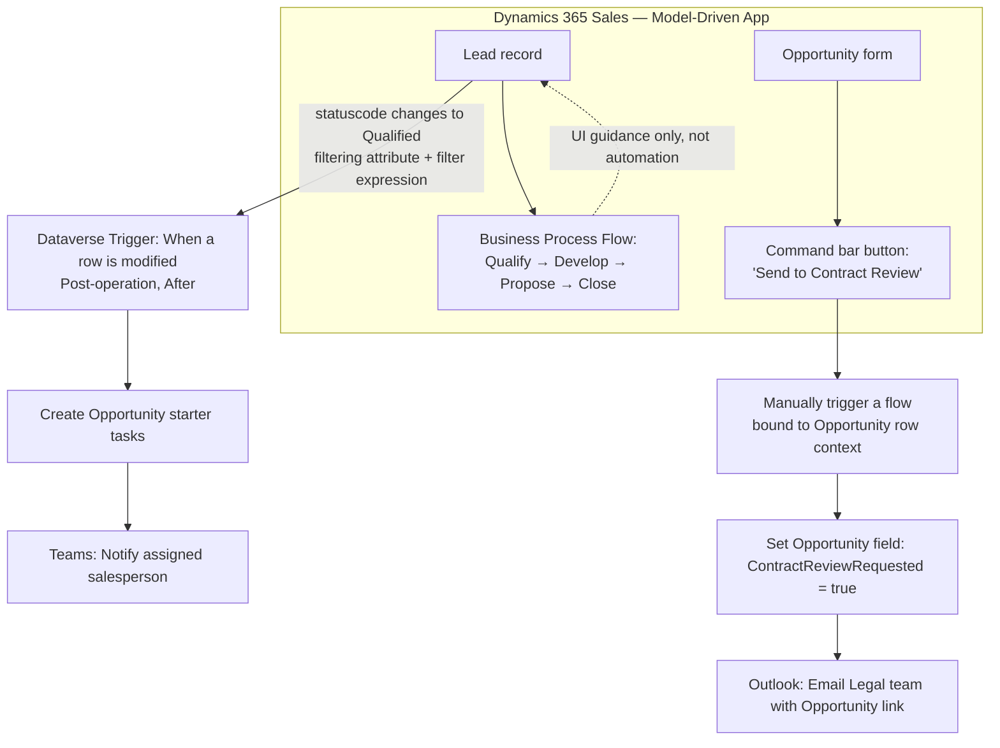

# Project 10 — Dynamics 365 Sales Automation: Lead-to-Opportunity Trigger Patterns
### 🔵 Difficulty: Bonus / Specialized (pairs with Intermediate-Advanced)

**Power Automate capability focus:** Dataverse triggers with filtering attributes/expressions, command-bar-invoked instant flows, Business Process Flow coexistence, before/after trigger scopes
**Connectors used:** Dataverse, Outlook, Teams
**Baseline:** Power Automate + Dynamics 365 Sales, as of July 2026 — see the companion **[Dynamics 365 Integration Guide](../../guides/dynamics-365-integration-guide.md)** for full background before starting this project

---

## 1. What you're building

Two connected pieces inside **Dynamics 365 Sales**: (1) an **automatic flow** that fires only when a Lead is genuinely qualified (not on every field edit), creates a starter task list on the resulting Opportunity, and notifies the assigned salesperson; and (2) a **command-bar button** on the Opportunity form — "Send to Contract Review" — that a salesperson clicks manually to kick off an instant flow, alongside a standard **Business Process Flow** guiding the stage progression in the UI. This project exists specifically to put the decision matrix from the Dynamics 365 Integration Guide into practice.

## 2. Why this project is a valuable addition to the repo

Every other project in this repo builds generic Power Automate skill. This one addresses the **Dynamics-specific trigger design decisions** that trip up even experienced Power Automate makers the first time they work inside a Dynamics 365 app: which connector to use, how to avoid a trigger firing on every irrelevant field edit, and how automatic flows, manual command-bar flows, and Business Process Flows coexist without stepping on each other.

## 3. Architecture

## 4. Step-by-step

### Part A — Automatic flow with proper filtering (post-operation trigger)
1. Create a new cloud flow using the **Dataverse connector's "When a row is modified"** trigger (not the legacy Dynamics 365 connector), scoped to the `Lead` table.
2. Set **filtering attributes** to only `statuscode` — this flow should not fire when a salesperson edits the Lead's phone number or notes.
3. Add a **filter expression**: `statuscode eq 3` (or your environment's actual "Qualified" status value) — the trigger should only actually run its logic when the Lead reaches that specific state, not merely when `statuscode` changes to any value.
4. Confirm the trigger is scoped to **post-operation (after)** — this is a notification/downstream-action scenario, not a validation-before-save scenario, so a before-trigger would be the wrong (and riskier) choice per the integration guide's decision matrix.
5. Add actions to create a starter task list on the resulting Opportunity record and send a Teams notification to the assigned salesperson.
6. Test by editing an unrelated Lead field (confirm the flow does **not** fire) and then changing status to Qualified (confirm it does).

### Part B — Manual, user-initiated flow via command bar
7. Create a second flow using **"Manually trigger a flow,"** and configure it to appear as a **command bar button on the Opportunity form** ("Send to Contract Review") — the user explicitly chooses to run this, it doesn't fire automatically on any field change.
8. Confirm the flow receives the specific Opportunity's row ID as context automatically, without the user needing to look anything up or paste an ID.
9. Have the flow set a tracking field on the Opportunity and email the Legal team with a direct link back to that specific record.
10. Test the button from a real Opportunity record and confirm the email's link opens the correct record directly.

### Part C — Confirm BPF coexistence
11. Open the standard **Business Process Flow** on the Lead-to-Opportunity process and confirm it continues to guide users through stages in the UI **independently** of the flows you just built — the BPF is a UI/UX aid, not a competing automation mechanism, and shouldn't be modified to try to "trigger" the flows above (that's not what it's for).
12. Document, in plain language a new team member could follow, which of the three mechanisms (automatic flow, manual command-bar flow, BPF) owns which part of this process — this clarity is exactly what prevents future makers from building a fourth, overlapping mechanism to solve a problem one of the first three already covers.

## 5. Best practices demonstrated
- **Always set filtering attributes and a filter expression** on any Dataverse trigger against a busy table — an unfiltered "when a row is modified" trigger on Lead or Opportunity is a near-guaranteed source of wasted runs.
- **Default to post-operation (after) triggers**; reserve pre-operation (before) triggers for genuine validation/blocking scenarios, not general automation.
- **Use command-bar-invoked instant flows for user-initiated, record-specific actions** rather than trying to force every action into an automatic trigger.
- **Document which mechanism owns which responsibility** (automatic flow vs. manual flow vs. BPF) so the system stays legible as more people build on it.

## 6. Limitations to know
- **Filtering attributes only control the automatic trigger's firing condition** — they don't retroactively fix a poorly-scoped filter expression; test both together, not just one.
- **Before-triggers can add latency to every save on that table** and, if the flow itself errors, may affect the save operation — treat this as a materially higher-stakes design choice than a standard after-trigger.
- **Command-bar button configuration lives in the app's UI customization**, not inside the flow itself — a change to the app (e.g., a re-designed command bar) can affect whether/where the button appears, independent of the flow's own health.
- **BPFs cannot directly trigger Power Automate flows** — if you need an action to fire specifically when a BPF stage changes, you trigger off the underlying Dataverse field change the BPF stage transition writes to, not off "the BPF" as a concept.

## 7. Licensing note
- Confirm whether this flow's connectors fall within your **Dynamics 365 Sales license's included Power Automate use rights** (scoped to flows operating within the Dynamics 365 context) or require separate Power Automate Premium/Process licensing — see the Dynamics 365 Integration Guide's licensing section for the full explanation of this common gap.

## 8. Demo script
1. Edit an unrelated field on a test Lead — show the automatic flow correctly **not** firing.
2. Change the Lead's status to Qualified — show the flow firing, the Opportunity task list appearing, and the Teams notification landing.
3. Open a test Opportunity and click "Send to Contract Review" — show the Legal team email arriving with a working direct link back to that exact record.
4. Walk through the BPF stages in the UI and explain, out loud, why it isn't and shouldn't be modified to try to trigger either flow.

## 9. Skills this project proves
Correct Dataverse trigger scoping (filtering attributes, filter expressions, before/after choice), command-bar-invoked instant flows bound to record context, and the judgment to keep automatic flows, manual flows, and Business Process Flows each doing the one job they're actually suited for.

**🔗 Live HTML mockup:** see `index.html` in this folder.
